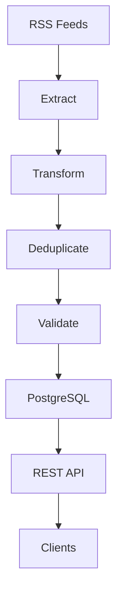

# Swedish News ETL Pipeline

A Python ETL pipeline that collects Swedish news articles from multiple RSS feeds, processes and validates the data, stores it in PostgreSQL, and exposes it through a FastAPI REST API.

## Architecture



## Features

- Extracts articles from multiple Swedish RSS sources
- Cleans, standardizes and enriches article data
- Detects politics-related articles
- Deduplicates articles by URL
- Validates required fields
- Stores data in PostgreSQL
- REST API with FastAPI and Swagger
- Automated testing with pytest
- Ruff linting and mypy type checking
- Test coverage with pytest-cov
- Dockerized application
- GitHub Actions CI/CD
- Scheduled ETL pipeline
- Versioned releases and Docker images

## Tech Stack

- Python
- PostgreSQL
- FastAPI
- Uvicorn
- Docker
- pytest
- Ruff
- mypy
- GitHub Actions
- GitHub Container Registry

## Quick Start

### 1. Configure environment variables

Create a `.env` file:

```bash
DB_HOST=localhost
DB_PORT=5432
DB_NAME=news
DB_USER=news_user
DB_PASSWORD=news_password
```

### 2. Start the services

```bash
docker compose up -d
```

### 3. Create the database schema

```bash
docker exec -i news-etl-postgres psql -U news_user -d news < sql/schema.sql
```

### 4. Install Python dependencies

```bash
pip install -r requirements.txt
```

### 5. Run the ETL pipeline

```bash
python main.py
```

### 6. Run the tests

```bash
pytest
```

### 7. Run quality checks

```bash
ruff check .
mypy tests
mypy src
```

## API

The API runs on port `8000` when started through Docker Compose.

Swagger documentation:

```text
http://localhost:8000/docs
```

Available endpoints:

- `GET /articles/`
- `GET /articles/{id}`
- `GET /health`

## CI/CD

GitHub Actions provides:

- Automated linting
- Static type checking
- Test execution and coverage
- Docker image builds
- Scheduled ETL pipeline runs
- Versioned releases

## Documentation

More detailed documentation is available in the `docs/` directory:

- [Architecture](docs/architecture.md)
- [Testing](docs/testing.md)
- [Deployment](docs/deployment.md)
- [CI/CD](docs/ci-cd.md)