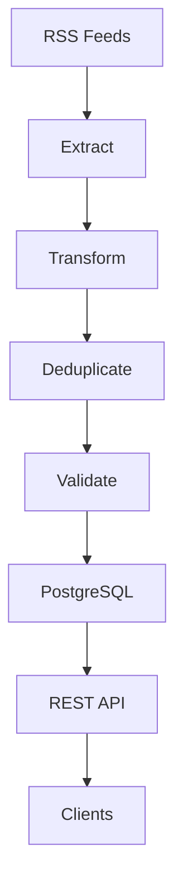

# Swedish News ETL Pipeline

A Python-based ETL pipeline that collects Swedish news articles from multiple RSS feeds, transforms and validates the data, stores it in PostgreSQL, and exposes it through a FastAPI REST API.

The project demonstrates a complete data engineering workflow including data ingestion, transformation, validation, database persistence, API development, testing, containerization, and CI/CD.

## Architecture



## Features

- Extracts articles from multiple Swedish RSS sources
- Cleans and standardizes article data
- Enriches articles with politics-related classification
- Deduplicates articles by URL
- Validates required fields
- Stores articles in PostgreSQL
- Tracks ETL pipeline executions
- REST API with pagination and filtering
- Interactive Swagger/OpenAPI documentation
- Unit, repository, API, and integration tests
- Test coverage with pytest-cov
- Ruff linting and mypy type checking
- Dockerized application and databases
- GitHub Actions CI/CD
- Scheduled ETL execution
- Versioned Docker images and GitHub Releases

## Tech Stack

- Python 3.12
- PostgreSQL
- FastAPI
- Uvicorn
- Docker / Docker Compose
- pytest
- pytest-cov
- Ruff
- mypy
- GitHub Actions
- GitHub Container Registry

## Quick Start

### 1. Configure environment variables

Create a `.env` file:

```env
DB_HOST=localhost
DB_PORT=5432
DB_NAME=news
DB_USER=news_user
DB_PASSWORD=news_password
```

### 2. Start the services

```bash
docker compose up -d
```

### 3. Create the database schema

```bash
docker exec -i news-etl-postgres psql -U news_user -d news < sql/schema.sql
```

### 4. Install Python dependencies

```bash
pip install -r requirements.txt
```

### 5. Run the ETL pipeline

```bash
python main.py
```

### 6. Run tests

```bash
pytest
```

### 7. Run local CI

```bash
python ci.py
```

To also build and verify the Docker environment:

```bash
python ci.py --docker
```

## API

The API runs on port `8000` when started through Docker Compose.

Swagger documentation:

```text
http://localhost:8000/docs
```

### Endpoints

| Method | Endpoint | Description |
|---|---|---|
| GET | `/articles/` | List articles with pagination and filters |
| GET | `/articles/{id}` | Get an article by ID |
| GET | `/pipeline-runs/` | List ETL pipeline executions |
| GET | `/health` | Check API and database health |

Example:

```text
GET /articles/?source=SVT&is_politics_related=true
```

## CI/CD

GitHub Actions provides:

- Automated linting and type checking
- Automated tests and coverage
- Docker image builds
- Scheduled ETL pipeline execution
- Versioned Docker images
- GitHub Releases

Releases are created using version tags:

```bash
git tag v1.0.0
git push origin v1.0.0
```

## Documentation

More detailed documentation is available in the `docs/` directory:

- [Architecture](docs/architecture.md)
- [Testing](docs/testing.md)
- [Deployment](docs/deployment.md)
- [CI/CD](docs/ci-cd.md)