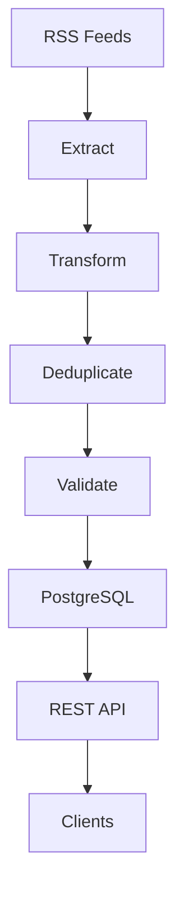

# Architecture

## Overview

Swedish News ETL Pipeline is a Python-based ETL system that collects Swedish news articles from multiple RSS feeds, processes and validates the data, stores the results in PostgreSQL, and exposes the data through a REST API.

The project is designed as a small but complete data engineering system covering ingestion, transformation, enrichment, deduplication, validation, persistence, API access, testing, containerization, deployment, and CI/CD.

## System Architecture



The ETL pipeline processes articles through a sequence of stages:

1. Extract data from RSS feeds
2. Clean and standardize the articles
3. Enrich the article data with categories
4. Deduplicate articles
5. Validate required fields
6. Store valid articles in PostgreSQL

Each pipeline execution is also tracked in the `pipeline_runs` table.

## Extract

The extract stage collects articles from **28 working Swedish RSS sources**.

The sources include national news organizations, broadcasters, business publications, and regional newspapers.

Each RSS entry is converted into a common article structure defined using Python's `TypedDict`.

The common article structure contains:

- Source
- Title
- Publication timestamp
- Article URL
- Image URL
- Summary
- Author name
- Author email

The extract stage also converts publication timestamps into timezone-aware `datetime` objects.

If an individual RSS source fails, the pipeline logs the error and continues processing the remaining sources.

## Transform

The transform stage prepares the extracted data before validation and loading.

It consists of several steps.

### Clean

String fields are stripped of unnecessary whitespace and empty strings are converted to `None`.

### Standardize

The standardization stage provides a common internal structure for article data.

This allows articles from different RSS sources to pass through the same downstream pipeline.

### Enrich

Articles are enriched with a category based on keyword matching in the article title and summary.

Current categories are:

- `politics`
- `sport`
- `economy`
- `technology`
- `other`

The category is stored in PostgreSQL and can be used by downstream consumers of the API.

### Deduplicate

Articles are deduplicated using their URL.

The URL is also defined as a unique constraint in PostgreSQL, providing a second layer of protection against duplicate records.

## Validate

The validation stage checks that required fields are present before data is loaded into PostgreSQL.

Required fields are:

- `source`
- `title`
- `published_at`
- `text_url`

Invalid articles are excluded from the load stage.

## PostgreSQL

PostgreSQL is the persistent storage layer.

The database contains two main tables:

### `articles`

Stores the transformed and validated news articles.

The table includes:

- Source and article metadata
- Publication timestamp
- Article URL
- Image URL
- Summary
- Author information
- Article category
- A unique constraint on the article URL

Article inserts use PostgreSQL's `ON CONFLICT` handling to safely skip duplicates.

### `pipeline_runs`

Stores information about individual ETL executions.

Each run records:

- Start time
- Finish time
- Status
- Number of extracted articles
- Number of transformed articles
- Number of valid articles
- Number of loaded articles
- Error information when applicable

This provides basic pipeline observability and makes failed executions visible through the API.

## Database Transactions

Database writes are performed inside transactions.

During article loading, all inserts are part of the same transaction. If an error occurs, the transaction is rolled back.

Pipeline run metadata is committed separately so that the final status of the pipeline can be recorded even when the article load fails.

## REST API

The project exposes the stored data through a FastAPI REST API.

Current endpoints include:

- `GET /articles/` — list articles
- `GET /articles/{id}` — fetch an article by ID
- `GET /pipeline-runs/` — list pipeline executions
- `GET /health` — check API and database health

The article endpoint supports:

- Pagination using `limit` and `offset`
- Filtering by source
- Filtering by category

FastAPI also provides interactive OpenAPI/Swagger documentation.

Production Swagger:

```text
https://news-etl-api.onrender.com/docs
```

## Repository Layer

Database queries are separated from the API and pipeline logic through repository modules.

```text
src/
├── repository/
│   ├── articles.py
│   └── pipeline_runs.py
```

The repository layer is responsible for database queries, while routers handle HTTP requests and responses.

This separation keeps database access isolated and makes the repository functions easier to test independently.

## Docker

Docker is used to provide a reproducible runtime environment.

The Docker Compose setup contains:

- PostgreSQL development database
- PostgreSQL test database
- FastAPI application

The API runs with Uvicorn inside its own container and communicates with PostgreSQL through the Docker Compose service name.

The test database runs separately from the development database to prevent tests from modifying development data.

## Testing

The project uses pytest with multiple testing levels:

- Unit tests for individual functions
- Repository tests against a real PostgreSQL test database
- API tests
- Integration tests covering the API together with PostgreSQL
- Pipeline tests covering pipeline execution and run tracking

The test suite also uses coverage reporting to detect regressions in tested code.

More details are documented in `docs/testing.md`.

## CI/CD

GitHub Actions automates the project's quality checks, scheduled ETL execution, Docker builds, and releases.

The three workflows are:

- `ci.yml` — continuous integration
- `pipeline.yml` — scheduled ETL execution
- `release.yml` — versioned releases

The scheduled pipeline first runs against a temporary PostgreSQL database. If the test pipeline succeeds, the production job runs the ETL pipeline against the production PostgreSQL database hosted on Render.

The CI workflow and release workflow also build Docker images and validate the application before changes are released.

The CI/CD architecture is documented separately in `docs/ci-cd.md`.

## Deployment

The production application is deployed on Render.

The deployment consists of:

- Render Web Service running the FastAPI application
- Render PostgreSQL for production data
- GitHub Actions for scheduled ETL execution
- GitHub Container Registry for Docker images

The production API is available at:

```text
https://news-etl-api.onrender.com
```

The production database is populated by the scheduled GitHub Actions pipeline.

## Latest Production Run

The latest successful production pipeline processed:

```text
Extracted:   1133
Transformed: 1133
Valid:       1133
Loaded:      1133
Status:      success
Duration:    ~2m 14s
```

The pipeline run is also recorded in the `pipeline_runs` table and exposed through the REST API.

## Design Decisions

### RSS instead of direct API integrations

RSS provides a simple and standardized way of collecting articles from multiple news sources without requiring separate API integrations for every source.

### TypedDict for article data

`TypedDict` provides static type checking while keeping article data as normal Python dictionaries.

This allows the same article structure to be passed between the different ETL stages while still benefiting from mypy type checking.

### PostgreSQL

PostgreSQL provides reliable persistent storage, constraints, transactions, and SQL querying capabilities.

It also provides a realistic relational database layer for development and integration testing.

### Separate test database

The test suite uses a dedicated PostgreSQL database running on a separate port.

This prevents tests from modifying development data.

### Repository layer

Database queries are separated from the API and pipeline logic.

This keeps responsibilities clear and makes database operations easier to test independently.

### FastAPI

FastAPI provides a lightweight REST API with automatic request validation and interactive OpenAPI/Swagger documentation.

### Docker

Docker makes the application and its dependencies reproducible and allows the API and databases to run consistently across environments.

### GitHub Actions

GitHub Actions provides automated quality checks, scheduled production ETL execution, Docker builds, and release automation.

The production pipeline is configured so that the production ETL job only runs after the pipeline test job succeeds.