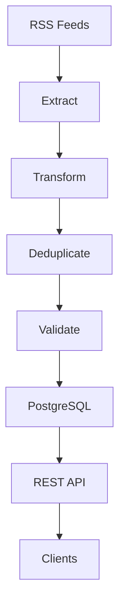

# Architecture

## Overview

Swedish News ETL Pipeline is a Python-based ETL system that collects Swedish news articles from multiple RSS feeds, processes and validates the data, stores it in PostgreSQL, and exposes the stored articles through a REST API.

The project is designed as a small but complete data engineering pipeline, covering data ingestion, transformation, validation, persistence, API access, testing, containerization, and CI/CD.

## Data Flow

## Extract

The extract stage collects articles from multiple Swedish RSS sources.

Currently supported sources include:

- SVT
- Aftonbladet
- Expressen
- Svenska Dagbladet

Each RSS entry is converted into a common article structure defined using Python's `TypedDict`.

The extract stage also normalizes publication timestamps into timezone-aware `datetime` objects.

## Transform

The transform stage prepares the extracted data before it is loaded into the database.

It consists of several steps:

### Clean

String fields are stripped of unnecessary whitespace and empty strings are converted to `None`.

### Standardize

The standardization stage ensures that article data follows the expected internal structure and data types.

### Enrich

Articles are enriched with an `is_politics_related` flag based on keyword matching in the article title and description.

### Deduplicate

Articles are deduplicated using their URL.

The URL is also defined as a unique constraint in PostgreSQL, providing a second layer of protection against duplicate records.

## Validate

The validation stage checks that required fields are present before data is loaded into PostgreSQL.

Required fields are:

- `source`
- `title`
- `url`
- `published_at`

Invalid articles are excluded from the load stage.

## PostgreSQL

PostgreSQL is used as the persistent storage layer.

The `articles` table stores the transformed and validated article data.

The article URL has a unique constraint, and inserts use PostgreSQL's `ON CONFLICT` handling to safely skip duplicates.

Database operations are performed inside transactions. If a load operation fails, the transaction is rolled back.

## REST API

The project exposes the stored articles through a FastAPI REST API.

Current endpoints:

- `GET /articles/` — list articles
- `GET /articles/{id}` — fetch an article by ID
- `GET /health` — check API and database health

The API also provides interactive Swagger documentation through FastAPI.

## Docker

Docker is used to provide a reproducible runtime environment.

The Docker Compose setup contains:

- PostgreSQL
- PostgreSQL test database
- FastAPI application

The API runs with Uvicorn inside its own container and communicates with PostgreSQL through the Docker Compose service name.

## Testing

The project uses pytest with multiple testing levels:

- Unit tests for individual functions and API behavior
- Repository tests against a real PostgreSQL test database
- Integration tests covering the API together with the database

This allows fast isolated tests while still verifying the database and API integration.

More details are documented in `docs/testing.md`.

## CI/CD

GitHub Actions is used for automated testing and delivery.

The CI workflow:

1. Starts a temporary PostgreSQL test service
2. Installs Python dependencies
3. Runs the complete test suite
4. Builds the Docker image

The pipeline workflow can run the ETL pipeline on a schedule using a temporary PostgreSQL database.

Version tags trigger the release workflow, which:

1. Runs the test suite
2. Builds the Docker image
3. Publishes the image to GitHub Container Registry
4. Creates a GitHub Release with a project artifact

## Design Decisions

### RSS instead of direct API integrations

RSS provides a simple and standardized way of collecting articles from multiple news sources without requiring separate API integrations for every source.

### TypedDict for article data

`TypedDict` provides static type checking while keeping the article data as a normal Python dictionary.

This makes the same article structure easy to pass between the different ETL stages.

### PostgreSQL

PostgreSQL provides reliable persistent storage, constraints, transactions, and SQL querying capabilities.

It also gives the project a realistic relational database layer for testing and development.

### Separate test database

The test suite uses a dedicated PostgreSQL database running on a separate port.

This prevents tests from modifying development data.

### FastAPI

FastAPI provides a lightweight REST API with automatic request validation and interactive OpenAPI/Swagger documentation.

### Docker

Docker makes the application and its dependencies reproducible and allows the API and databases to run consistently across environments.